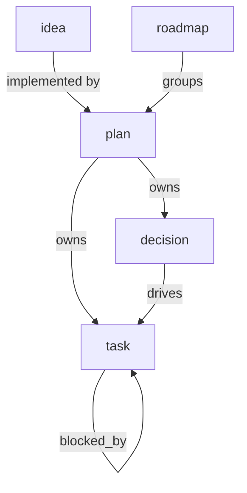

# Worktracking Conventions v0 Proposal

- Kind: convention
- Status: active

- Use this document to structure worktracking entirely with `patram` metadata
  and queries.
- Keep parent-child relations normalized from child to parent.
- Treat implementation progress as derived state whenever possible.

## Terms

- `idea`: A lightweight note that captures a possible change without committing
  to implementation. Store ideas in `docs/research/`.
- `roadmap`: A coordination document for a milestone, version, or theme. Store
  roadmaps in `docs/roadmap/`.
- `plan`: A change-level design and execution document. Store plans in
  `docs/plans/<version>/`.
- `decision`: A resolved design choice derived from one plan. Store decisions in
  `docs/decisions/`.
- `task`: An atomic agent instruction derived from one plan and one or more
  decisions. Store tasks in `docs/tasks/<version>/`.
- `terminal task status`: One of `done`, `dropped`, or `superseded`.
- `implemented`: A derived execution state, not a stored document status.

## Relationship Model



## Process

1. Capture an idea in `docs/research/` as `Kind: idea`.
2. When the repo intends to act on the idea, write one plan in
   `docs/plans/<version>/`.
3. Derive one or more decisions from that plan and record them in
   `docs/decisions/`.
4. Derive one or more tasks from the plan and its decisions and record them in
   `docs/tasks/<version>/`.
5. Execute tasks and update only task status during routine implementation.
6. Treat a decision as implemented when every task that points to it is in a
   terminal task status.
7. Treat a plan as implemented when every task that tracks into it is in a
   terminal task status.
8. Treat roadmap rollups as deferred until traversal and aggregation support is
   available.

## Metadata Rules

```json
{
  "idea": {
    "path": "docs/research/",
    "required": ["Kind", "Status"],
    "optional": [],
    "allowed_status": [
      "captured",
      "exploring",
      "planned",
      "dropped",
      "superseded"
    ]
  },
  "roadmap": {
    "path": "docs/roadmap/",
    "required": ["Kind", "Status"],
    "optional": [],
    "allowed_status": ["proposed", "active", "superseded", "dropped"]
  },
  "plan": {
    "path": "docs/plans/<version>/",
    "required": ["Kind", "Status", "Tracked in"],
    "optional": ["Implements"],
    "allowed_status": ["proposed", "active", "superseded", "dropped"],
    "tracked_in_path": "docs/roadmap/",
    "implements_path": "docs/research/"
  },
  "decision": {
    "path": "docs/decisions/",
    "required": ["Kind", "Status", "Tracked in"],
    "optional": [],
    "allowed_status": ["proposed", "accepted", "rejected", "superseded"],
    "tracked_in_path": "docs/plans/"
  },
  "task": {
    "path": "docs/tasks/<version>/",
    "required": ["Kind", "Status", "Tracked in", "Decided by"],
    "optional": ["Blocked by"],
    "allowed_status": [
      "pending",
      "in_progress",
      "blocked",
      "done",
      "dropped",
      "superseded"
    ],
    "tracked_in_path": "docs/plans/",
    "decided_by_path": "docs/decisions/",
    "blocked_by_path": "docs/tasks/"
  }
}
```

## Cardinality Rules

- `idea` documents use one `Kind` and one `Status`.
- `roadmap` documents use one `Kind` and one `Status`.
- `plan` documents use one `Kind`, one `Status`, one `Tracked in`, and zero or
  more `Implements`.
- `decision` documents use one `Kind`, one `Status`, and one `Tracked in`.
- `task` documents use one `Kind`, one `Status`, one `Tracked in`, one or more
  `Decided by`, and zero or more `Blocked by`.

## Status Rules

- Do not mark `decision` or `plan` documents as implemented by changing their
  `Status`.
- Use `decision` status for decision lifecycle, such as `proposed`, `accepted`,
  `rejected`, or `superseded`.
- Use `plan` and `roadmap` status for document lifecycle, such as `proposed`,
  `active`, `superseded`, or `dropped`.
- Use `task` status for execution state.

## Derived State

- A task is complete when its `Status` is one of `done`, `dropped`, or
  `superseded`.
- A decision is implemented when no task with `Decided by: <decision-path>`
  remains outside a terminal task status.
- A plan is implemented when no task with `Tracked in: <plan-path>` remains
  outside a terminal task status.
- A roadmap rollup is deferred until query traversal and aggregation exist.
- `patram query` and `patram show` should render derived execution summaries for
  `decision`, `plan`, and `roadmap` documents once traversal-backed output
  summaries exist.

## Stored Queries

```json
{
  "ideas": {
    "where": "kind=idea and status in [captured, exploring, planned]"
  },
  "active-roadmaps": {
    "where": "kind=roadmap and status=active"
  },
  "active-plans": {
    "where": "kind=plan and status=active"
  },
  "plans-without-decisions": {
    "where": "kind=plan and status=active and none(in:tracked_in, kind=decision)"
  },
  "decision-review-queue": {
    "where": "kind=decision and status=proposed"
  },
  "accepted-decisions": {
    "where": "kind=decision and status=accepted"
  },
  "decisions-needing-tasks": {
    "where": "kind=decision and status=accepted and count(in:decided_by, kind=task) = 0"
  },
  "pending-tasks": {
    "where": "kind=task and status=pending"
  },
  "in-progress-tasks": {
    "where": "kind=task and status=in_progress"
  },
  "blocked-tasks": {
    "where": "kind=task and status=blocked"
  },
  "plans-with-open-tasks": {
    "where": "kind=plan and status=active and any(in:tracked_in, kind=task and status not in [done, dropped, superseded])"
  },
  "decisions-with-open-tasks": {
    "where": "kind=decision and status=accepted and any(in:decided_by, kind=task and status not in [done, dropped, superseded])"
  }
}
```

## Ad Hoc Query Patterns

- Use `doc:<path>` relation targets when querying document-to-document
  relations.

```bash
patram query --where 'kind=task and status=pending'
patram query --where 'tracked_in=doc:docs/plans/v0/patram-worktracking.md and status not in [done, dropped, superseded]'
patram query --where 'decided_by=doc:docs/decisions/patram-worktracking.md and status not in [done, dropped, superseded]'
patram query --where 'kind=plan and none(in:tracked_in, kind=decision)'
```
