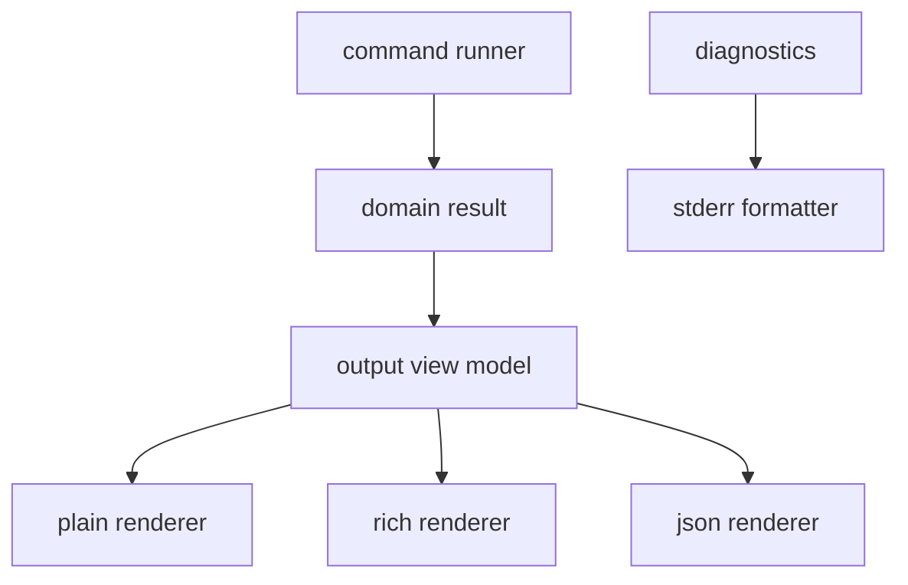

# CLI Output Architecture Proposal

- Kind: decision
- Status: proposed
- Tracked in: docs/roadmap/v0-dogfood.md

- Separate command execution from output rendering.
- Normalize command results into one shared view model.
- Add three renderers: `rich`, `plain`, and `json`.
- Treat `plain` as the canonical human-readable layout.
- Treat `rich` as a sibling renderer that preserves the `plain` layout's
  structure.
- Default to `rich` only when `stdout` is a TTY.
- Keep diagnostics outside the result renderer pipeline.
- Model resolved links as resolved target objects, not path strings.

## Architecture



## View Model

```json
{
  "command": "query",
  "summary": {
    "kind": "result_list",
    "count": 1
  },
  "items": [
    {
      "kind": "node",
      "node_kind": "task",
      "title": "Implement query command",
      "path": "docs/tasks/v0/query-command.md",
      "status": "pending",
      "id": "doc:docs/tasks/v0/query-command.md"
    }
  ],
  "hints": ["Try: patram query pending"]
}
```

## Resolved Link Item

```json
{
  "kind": "resolved_link",
  "reference": 1,
  "label": "query language",
  "target": {
    "title": "Query Language v0",
    "path": "docs/decisions/query-language-v0.md",
    "kind": "decision",
    "status": "accepted"
  }
}
```

## Boundaries

- Command logic owns graph loading, query execution, and validation.
- The view model owns display labels, summaries, and optional hints.
- The view model exposes resolved target metadata for `show`.
- The view model assigns stable reference numbers for rendered link footnotes.
- The plain renderer owns canonical line breaks, ordering, and alignment.
- The rich renderer consumes the same view model directly as the plain renderer.
- The rich renderer owns color, hyperlinking, and divider expansion only.
- The rich renderer must not parse rendered plain text.
- JSON serialization remains a separate renderer.
- Diagnostic formatting stays separate so failures keep one code path and one
  stream.

## Rationale

- One result model keeps `check`, `query`, and `show` visually consistent.
- A canonical plain layout keeps documentation, tests, and snapshots focused on
  one structure.
- A sibling rich renderer preserves the TTY experience without creating a second
  output language or a text-parsing pipeline.
- JSON output becomes an additive renderer instead of a parallel command
  surface.
- Keeping diagnostics separate preserves the current `stderr` behavior for
  failures.
