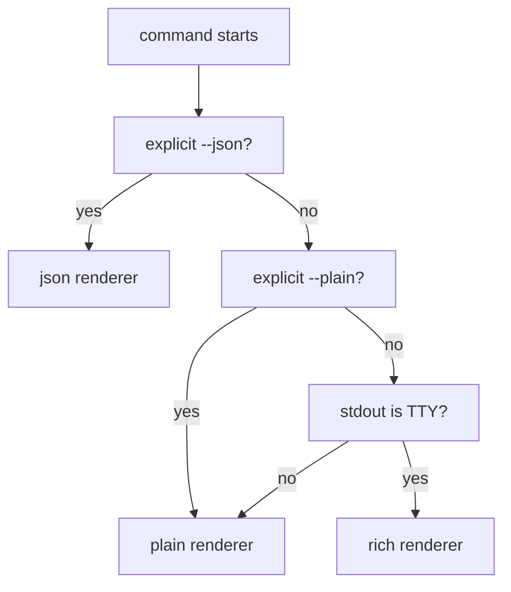

# CLI Output Modes Proposal

- Kind: decision
- Status: accepted
- Tracked in: docs/roadmap/v0-dogfood.md

- Results go to `stdout`.
- Diagnostics, warnings, progress, and hints about failures go to `stderr`.
- Support `--plain` and `--json` as explicit output modes.
- Default to `rich` when `stdout` is a TTY and no output mode flag is passed.
- Define `rich` as a sibling renderer that preserves the `plain` layout while
  adding presentation enhancements.
- Support `--color=auto|always|never` and `--no-color`.
- Respect `NO_COLOR` and `TERM=dumb`.

## Mode Selection



## Behavior

- `plain`: canonical human-readable layout for pipes, snapshots, docs, and shell
  tools.
- `rich`: the same layout as `plain`, plus color, hyperlink support, and visual
  dividers.
- `json`: structured command output for downstream tools.
- `plain` and `rich` both render directly from the shared output view model.

## Stream Contract

```json
{
  "stdout": ["results", "empty-state summaries", "success summaries"],
  "stderr": ["diagnostics", "validation failures", "warnings", "progress"]
}
```

## Rationale

- TTY-aware rendering follows [clig.dev](https://clig.dev/) without forcing rich
  output into pipes.
- Explicit output flags make automation predictable.
- Color and hyperlinking remain presentation choices instead of part of the data
  contract.
- Keeping `rich` and `plain` as sibling renderers avoids a fragile
  render-then-parse pipeline.
- Keeping success output brief in `rich` mode improves confidence without adding
  log noise.
