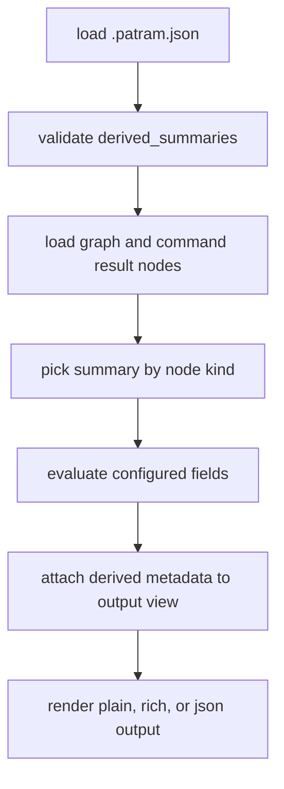

# Declarative Derived Summary Side Effects Proposal

- kind: decision
- status: accepted
- tracked_in: docs/plans/v0/declarative-derived-summaries.md

- Treat derived summaries as output-time metadata only.
- Do not materialize derived summary fields into graph nodes, claims, or stored
  document metadata.
- Evaluate derived summaries after graph loading and command-specific graph
  resolution, but before output-view construction.
- Let `query` attach at most one derived summary to each result node based on
  that node's kind.
- Let `show` evaluate derived summaries for the shown document self-summary and
  for each resolved-link target independently.
- Leave `check` and `queries` unchanged.
- Keep stored metadata on the first metadata row and render derived fields on a
  second row when present.
- Preserve configured field order in `plain`, `rich`, and `json` output.
- Add `derived_summary` as the selected summary name in JSON output and keep
  `derived` as the flat field-value object.
- Surface invalid derived summary config as normal `config.invalid` diagnostics
  during config loading instead of partial runtime fallback.
- Treat post-validation evaluation failures as programming errors that should
  throw rather than silently dropping derived fields.

## Output Contract

### Plain

```txt
document docs/plans/v0/query-traversal-and-aggregation.md
kind: plan  status: active
execution: done  open_tasks: 0  blocked_tasks: 0  total_tasks: 4

    Query Traversal And Aggregation Plan
```

### JSON

```json
{
  "id": "doc:docs/plans/v0/query-traversal-and-aggregation.md",
  "kind": "plan",
  "path": "docs/plans/v0/query-traversal-and-aggregation.md",
  "status": "active",
  "title": "Query Traversal And Aggregation Plan",
  "derived_summary": "plan_execution",
  "derived": {
    "execution": "done",
    "open_tasks": 0,
    "blocked_tasks": 0,
    "total_tasks": 4
  }
}
```

## Evaluation Flow



## Rationale

- Output-only evaluation keeps graph semantics and display semantics separate.
- Reusing the existing output-view boundary avoids command-specific renderer
  branches.
- Failing config early gives repos a single debugging path through
  `patram check` and normal command startup.
- Keeping `derived` flat preserves the current entity-summary shape while still
  exposing which summary definition produced it.
