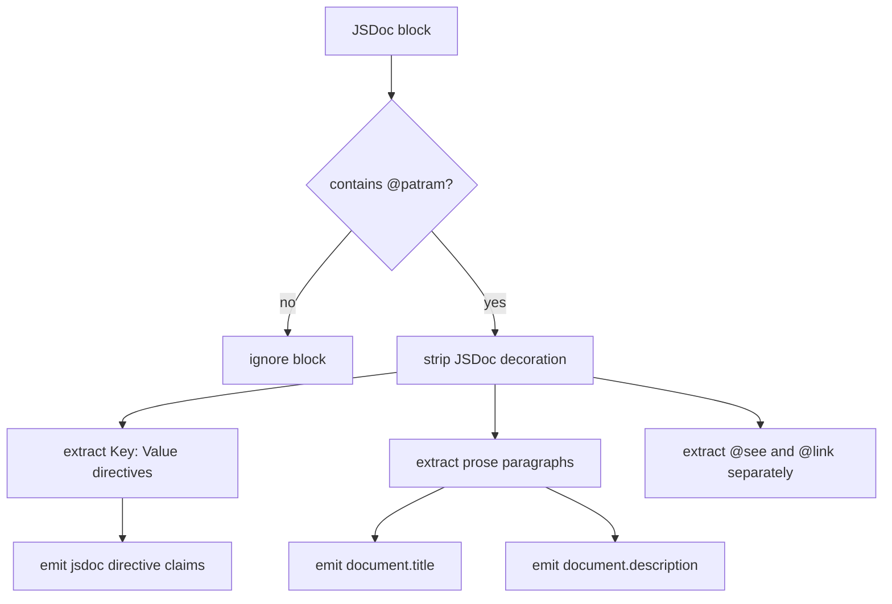

# JSDoc Metadata Directive Syntax Proposal

- Kind: decision
- Status: accepted
- Tracked in: docs/plans/v0/jsdoc-metadata-directive-syntax.md

- Support JSDoc-style Patram metadata blocks in JavaScript and TypeScript source
  files.
- Treat a JSDoc block as Patram metadata only when it contains `@patram`.
- Allow explicit `Key: Value` directives anywhere in the activated block.
- Derive prose claims from non-directive, non-tag lines in the activated block.
- Emit `document.title` from the first prose paragraph and fall back to the
  first sentence when that paragraph is long.
- Emit `document.description` from the remaining prose after the title source.
- Keep directive claims neutral and map them through `jsdoc.directive.<name>`.
- Keep directive values as strings in v0.
- Keep one effective `@patram` block per file in v0.

## Example

```js
/**
 * This is the title of the node.
 *
 * Here comes a longer description that might span more
 * than one line.
 *
 * Kind: task
 * Status: pending
 * Tracked in: docs/roadmap/v0-dogfood.md
 *
 * @patram
 * @see ../docs/patram.md
 */
```

## Activation Rules

- Patram metadata is recognized only in JSDoc block comments.
- A JSDoc block becomes active for Patram parsing only when it contains the
  literal `@patram` tag.
- `@patram` may appear anywhere in the JSDoc block.
- Directive lines may appear before, between, or after JSDoc tags and prose
  paragraphs.
- A file may contain at most one effective Patram JSDoc block in v0.
- Multiple JSDoc blocks that contain `@patram` should produce a validation
  diagnostic instead of being merged heuristically.

## Prose Rules

- Remove the leading JSDoc decoration before parsing block content.
- Blank lines split prose paragraphs.
- Wrapped lines inside one paragraph join with spaces.
- Lines that parse as directives do not contribute to prose.
- JSDoc tag lines such as `@patram`, `@see`, and `@link` do not contribute to
  prose.
- The first prose paragraph is the title source.
- If the first prose paragraph is longer than `120` characters and contains a
  sentence boundary, the title becomes the first sentence of that paragraph.
- Otherwise the title is the full first prose paragraph.
- Remaining prose, including the remainder of a split first paragraph, becomes
  `document.description`.
- If the active Patram block contains no prose, the parser emits no
  `document.title` or `document.description` claim.

## Directive Rules

- Visible directives use the same syntax as markdown body metadata:
  `Key: Value`.
- Directive labels should use a leading capital letter to stay explicit.
- Directive labels normalize spaces, hyphens, and mixed case to
  `lower_snake_case`.
- Directive values remain raw strings in v0.
- Repeated relation directives emit repeated claims.
- Repeated singleton directives remain valid and later materialization wins when
  mappings write the same node field.
- Lowercase prose lines such as `status: pending` are not treated as directives.

## Claim Shape

```json
[
  {
    "type": "document.title",
    "value": "This is the title of the node."
  },
  {
    "type": "document.description",
    "value": "Here comes a longer description that might span more than one line."
  },
  {
    "type": "directive",
    "parser": "jsdoc",
    "name": "kind",
    "value": "task"
  },
  {
    "type": "directive",
    "parser": "jsdoc",
    "name": "status",
    "value": "pending"
  },
  {
    "type": "directive",
    "parser": "jsdoc",
    "name": "tracked_in",
    "value": "docs/roadmap/v0-dogfood.md"
  }
]
```



## Rationale

- Keeping `@patram` as a block activator lets directive lines live anywhere in
  the block, which works better with linters and normal JSDoc style.
- Reusing markdown-style `Key: Value` syntax avoids inventing a second metadata
  language just for source files.
- Prose-derived title and description claims make source files fit the same
  document-oriented graph model as markdown.
- Restricting v0 to one effective Patram block per file avoids ambiguous merge
  semantics while the graph stays document-centric.
