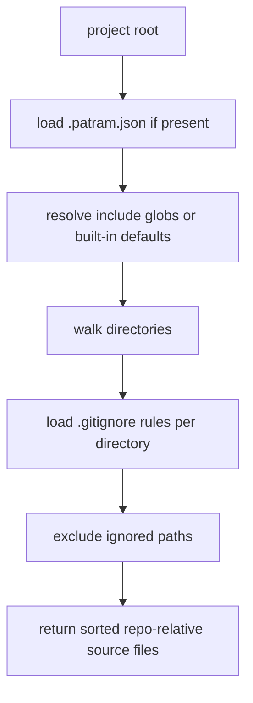

# Optional Config Default Scan Proposal

- kind: decision
- status: accepted
- tracked_in: docs/plans/v0/optional-config-default-scan.md

- `.patram.json` stays the single discovered project config file when present.
- Patram also works when `.patram.json` is absent.
- When config is absent, Patram uses built-in defaults for scanning and stored
  queries.
- When config is present, `include` is optional. Missing `include` falls back to
  the same built-in scan defaults.
- Built-in scan defaults cover every file extension Patram currently parses.
- Source scanning applies `.gitignore` exclusions automatically.
- Every discovered `.gitignore` file applies to its own directory subtree.
- Scan results stay repo-relative, unique, and lexicographically sorted.

## Defaults

```json
{
  "include": ["**/*.md", "**/*.markdown"],
  "queries": {}
}
```

## Scan Flow



## Rationale

- `patram check`, `patram show`, and `patram query` should work in a repo before
  a project-specific config exists.
- Defaulting to supported file endings keeps scanning aligned with actual parser
  support.
- Respecting `.gitignore` avoids indexing generated, vendored, and local-only
  files without duplicating exclude settings in Patram config.
