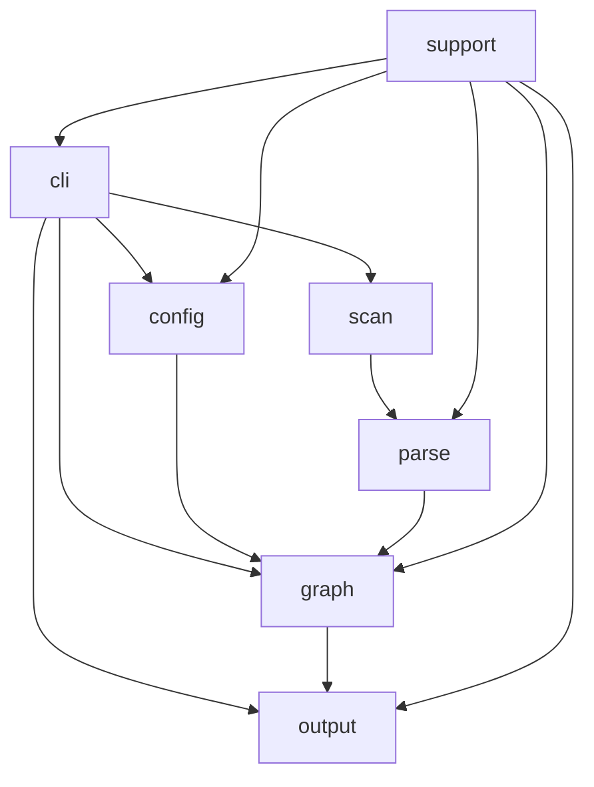

# Source Layout Modularization Proposal

- kind: decision
- status: accepted
- tracked_in: docs/plans/v0/source-layout-modularization.md

- Align the physical `lib/` layout with the repo's documented source-anchor
  kinds: `cli`, `config`, `scan`, `parse`, `graph`, `output`, and `support`.
- Replace the flat `lib/` namespace with subsystem directories that make the
  main learning paths obvious from the filesystem.
- Keep the package root and CLI entrypoints stable while the layout migrates.
- Prefer small orchestrator modules plus focused leaf helpers over
  subsystem-sized files.
- Migrate incrementally with compatibility re-export shims instead of one
  flag-day move.
- Keep adjacent unit tests with their implementation modules and keep repo-level
  contract tests in `test/`.
- Add explicit dependency rules between subsystems so the new layout reduces
  coupling instead of only moving files.

## Target Layout

```text
lib/
  cli/
    main.js
    parse-arguments.js
    help/
    commands/
      check.js
      fields.js
      query.js
      queries.js
      refs.js
      show.js
  config/
    load.js
    schema.js
    defaults.js
    validation/
  scan/
    list-source-files.js
  parse/
    claims.js
    markdown/
    jsdoc/
    yaml/
  graph/
    build.js
    identity.js
    overlay.js
    query/
      parse.js
      semantics.js
      execute.js
      inspect.js
  output/
    view-model/
    renderers/
      plain.js
      rich.js
      json.js
    rich-source/
  support/
```

## Boundaries

- `cli` owns command dispatch, shared command context, and exit codes.
- `config` owns file loading, defaults, schema parsing, and config diagnostics.
- `scan` owns source file discovery only.
- `parse` owns source-text to claim extraction only.
- `graph` owns claim materialization, graph identity, query parsing, query
  semantics, and graph evaluation.
- `output` owns view-model mapping and renderer-specific formatting.
- `support` owns utilities that are intentionally shared and are not
  domain-specific.
- `cli` may depend on `config`, `scan`, `graph`, `output`, and `support`.
- `output` may depend on graph result types and view-model inputs, but not on
  CLI parsing or config loading.
- `parse` and `graph` must not depend on `output`.
- `config` must not depend on `output`.

## Migration Rules

- Keep public package exports stable from `lib/patram.js`.
- Keep `bin/patram.js` as the CLI process entrypoint.
- Leave temporary re-export shim files in place while imports are being moved.
- Move one vertical slice at a time so tests and blame stay readable.
- Prefer renaming modules to match their folder role during the move.
- Split oversized files while moving them instead of preserving large files in a
  new directory.

## Dependency Shape



## Rationale

- The repo already documents stable source responsibilities by kind, but the
  flat `lib/` directory hides those boundaries from readers.
- Large subsystem files make the code searchable but force contributors to load
  too much context before making a focused change.
- A directory layout that mirrors the domain model shortens the path from a user
  question to the relevant code.
- Incremental moves with shims keep the refactor compatible with ongoing feature
  work.
