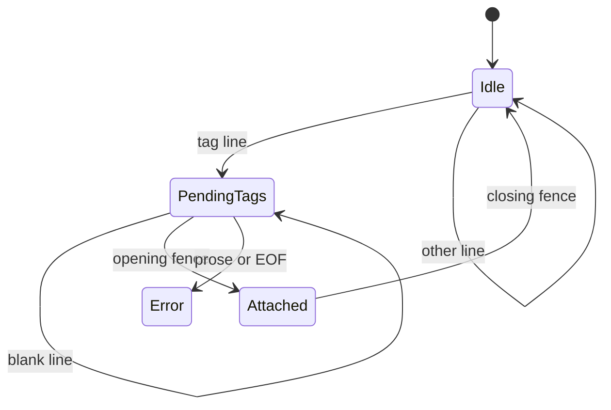

# Tagged Fenced Block Extraction Proposal

- kind: decision
- status: accepted
- tracked_in: docs/plans/v0/tagged-fenced-block-extraction.md

- Add a markdown-only API for extracting tagged fenced code blocks from one
  file.
- Keep tagged fenced block extraction separate from `patram query`, graph
  indexing, and graph nodes.
- Support a pure extractor that accepts `{ file_path, source_text }`.
- Support a file-reading convenience wrapper for path-based callers.
- Return all tagged fenced blocks from one file in source order.
- Keep block metadata generic key/value strings and do not reserve `example` as
  a built-in key.
- Support exact-match selection through `selectTaggedBlock` and
  `selectTaggedBlocks`.
- Ignore untagged fenced blocks.
- Treat tags as a prefix that attaches only to the next fenced block.
- Fail fast for malformed tag sets, duplicate metadata keys, and ambiguous
  singular selection.

## API Surface

```js
const spec_file = await loadTaggedFencedBlocks(
  'docs/reference/commands/query.md',
);

const input_block = selectTaggedBlock(spec_file.blocks, {
  example: 'query-basic',
  role: 'input',
});

const output_blocks = selectTaggedBlocks(spec_file.blocks, {
  example: 'query-basic',
});
```

- `extractTaggedFencedBlocks({ file_path, source_text })` parses one markdown
  file and returns all tagged fenced blocks.
- `loadTaggedFencedBlocks(file_path)` reads one markdown file and delegates to
  `extractTaggedFencedBlocks(...)`.
- `selectTaggedBlock(blocks, criteria)` returns one exact metadata match and
  throws when zero or multiple blocks match.
- `selectTaggedBlocks(blocks, criteria)` returns all exact metadata matches in
  source order.

## Return Shape

```json
{
  "path": "docs/reference/commands/query.md",
  "title": "Query",
  "blocks": [
    {
      "id": "block:docs/reference/commands/query.md:12",
      "lang": "sh",
      "value": "patram query --where \"kind=task and status=pending\"",
      "metadata": {
        "example": "query-basic",
        "role": "input"
      },
      "origin": {
        "path": "docs/reference/commands/query.md",
        "line_start": 12,
        "line_end": 14,
        "tag_lines": [9, 10]
      },
      "context": {
        "heading_path": ["Query", "Examples"]
      }
    }
  ]
}
```

- `path` identifies the parsed markdown file.
- `title` mirrors the document title for diagnostics and snapshots.
- `blocks` contains tagged fenced blocks in source order.
- `id` is derived for diagnostics and does not replace user-authored metadata.
- `lang` is the raw fence info string or the empty string when omitted.
- `value` is the raw fenced block content.
- `metadata` stores arbitrary user-authored tag key/value pairs.
- `origin` stores file and line locations for the block and its tags.
- `context.heading_path` is informational context and is not the primary
  selector identity.

## Tag Syntax

````md
example: query-basic role: input

```sh
patram query --where "kind=task and status=pending"
```
````

````md
[patram example=query-basic role=input]: #

```sh
patram query --where "kind=task and status=pending"
```
````

- Hidden tagged-block metadata uses the literal `patram` marker.
- One hidden tag line may contain one or more `key=value` pairs.
- Single-pair and multi-pair tag lines are equivalent after parsing.
- Keys use lowercase snake case and match `^[a-z][a-z0-9_]*$`.
- Values are raw non-whitespace strings in v0.
- v0 does not support quoting or escaping inside tagged-block metadata values.
- Tagged-block metadata keys are preserved as written and are not mapped to
  graph directives.

## Attachment Rules

- Tagged-block metadata is recognized only outside fenced code blocks.
- A contiguous pending tag set attaches only to the next fenced block.
- Multiple adjacent tag lines merge into one metadata object.
- Blank lines between a pending tag set and the next fenced block are allowed.
- Any non-blank, non-tag line before the next fenced block is a parse error.
- Duplicate metadata keys within one pending tag set are a parse error.
- After a fenced block opens, its pending tag set is consumed and cleared.
- Untagged fenced blocks are ignored by this extractor.
- Pending tags left at end of file are a parse error.



## Selector Semantics

- Selection criteria match exact `metadata` key/value pairs only.
- Every criterion must match for a block to be selected.
- `selectTaggedBlock(...)` throws a typed error when no block matches.
- `selectTaggedBlock(...)` throws a typed error when multiple blocks match.
- `selectTaggedBlocks(...)` returns all matches in source order.
- `heading_path` remains contextual output and does not participate in matching
  unless a future API adds explicit support for that.
- Top-level block fields such as `lang` are not matched through metadata
  criteria in v0.

## Rationale

- Patram's current query language targets graph nodes, so tagged fenced block
  extraction should not repurpose `patram query` for markdown syntax lookup.
- File-oriented extraction lets one parse serve multiple example lookups from
  the same specification file.
- Generic metadata keeps the API useful for repository-specific conventions such
  as `example`, `fixture`, `case`, `role`, or `phase`.
- Exact-match selectors and deterministic attachment rules keep test fixtures
  stable when surrounding prose and headings evolve.
