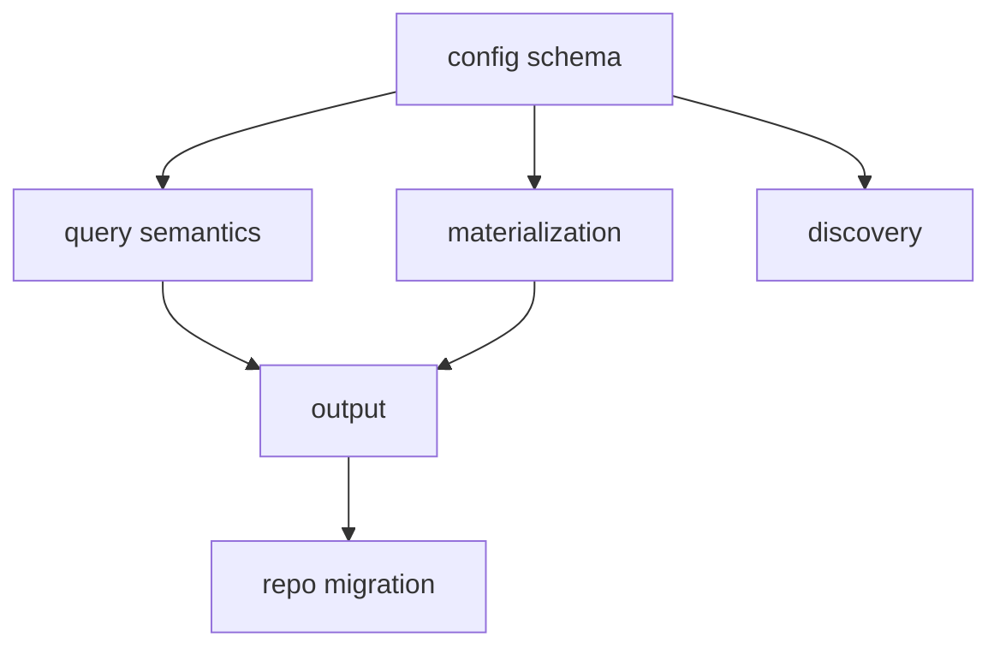

# Field Model Redesign Plan

- kind: plan
- status: active
- tracked_in: docs/roadmap/field-model-redesign.md
- decided_by: docs/decisions/schema-defined-query-fields.md
- decided_by: docs/decisions/patram-structural-field-namespace.md
- decided_by: docs/decisions/class-based-config-vocabulary.md
- decided_by: docs/decisions/metadata-field-schema.md
- decided_by: docs/decisions/type-driven-query-operators.md
- decided_by: docs/decisions/field-materialization-conflicts.md
- decided_by: docs/decisions/query-output-open-metadata.md
- decided_by: docs/decisions/query-validation-lifecycle.md
- decided_by: docs/decisions/field-discovery-workflow.md

## Goal

- Replace the fixed query field model with an explicit metadata field schema.
- Move Patram-owned structural query fields to the reserved `$` namespace.
- Align config, materialization, validation, query semantics, and output with
  the new field model.
- Add a dedicated field discovery workflow that suggests schema without
  activating it.

## Scope

- New config vocabulary:
  - `classes`
  - `fields`
  - `class_schemas`
- New structural query fields:
  - `$id`
  - `$class`
  - `$path`
- `title` as a well-known semantic field with deterministic fallback.
- Type-driven query validation and evaluation.
- Single-valued conflict detection and multi-valued set semantics.
- JSON and plain output updates for open metadata.
- A dedicated `fields` command group for field discovery.
- Repo dogfooding:
  - config migration
  - stored query migration
  - derived summary migration
  - help and reference updates
- No backward compatibility layer.
- No aliases or legacy field names.

## Workstreams

### 1. Config Schema And Vocabulary

- Task:
  [Define Field Model Config Schema](../../tasks/v1/field-model-config-schema.md)
- Owns:
  - config types
  - config loading
  - config validation
  - `classes`/`fields`/`class_schemas` vocabulary
- Write scope:
  - `lib/load-patram-config*`
  - `lib/patram-config*`
  - `lib/resolve-patram-graph-config.js`
  - config-facing docs and tests

### 2. Query Semantics And Validation

- Task:
  [Implement Field Model Query Semantics](../../tasks/v1/field-model-query-semantics.md)
- Owns:
  - field resolution in queries
  - type-driven operator validation
  - stored-query validation
  - query inspection and stored-query layout alignment
- Write scope:
  - `lib/parse-where-clause*`
  - `lib/query-graph*`
  - `lib/query-inspection*`
  - `lib/layout-stored-queries.js`
  - query help and query docs

### 3. Materialization And Conflict Handling

- Task:
  [Implement Field Materialization Rules](../../tasks/v1/field-model-materialization.md)
- Owns:
  - field population rules
  - structural field migration
  - single-value conflict detection
  - multi-value set semantics
  - `title` precedence and fallback
- Write scope:
  - `lib/build-graph*`
  - `lib/build-graph-identity.js`
  - `lib/check-directive-*`
  - graph-oriented docs and tests

### 4. Output Contract And Renderers

- Task: [Implement Open Metadata Output](../../tasks/v1/field-model-output.md)
- Owns:
  - JSON output contract
  - plain-text header and metadata layout
  - metadata visibility and ordering
  - show and resolved-link output alignment
- Write scope:
  - `lib/output-view.types.ts`
  - `lib/render-*`
  - `lib/show-document.js`
  - output docs and tests

### 5. Field Discovery Command

- Task: [Add Field Discovery Workflow](../../tasks/v1/field-model-discovery.md)
- Owns:
  - `fields` command group
  - discovery report output
  - evidence, confidence, and conflict reporting
- Write scope:
  - CLI argument parsing
  - command dispatch
  - discovery implementation files
  - discovery docs and tests

### 6. Repo Migration And Dogfooding

- Task:
  [Migrate Repo To The New Field Model](../../tasks/v1/field-model-migration.md)
- Owns:
  - `.patram.json` migration
  - stored query migration
  - help, conventions, and reference updates
  - final repo dogfooding
- Write scope:
  - `.patram.json`
  - `docs/reference/`
  - `docs/conventions/`
  - `docs/patram.md`
  - repo integration tests

## Parallelism

- Start with config schema work.
- After config schema is stable, run query semantics and materialization in
  parallel.
- Start output work after query semantics and materialization land.
- Start field discovery after config schema is stable.
- Finish with repo migration and dogfooding after the runtime and output
  surfaces stabilize.

## Order

1. Add failing tests for config schema, query semantics, materialization rules,
   and output shape.
2. Implement the new config vocabulary and validation model.
3. Implement structural and metadata field resolution in query parsing and
   evaluation.
4. Implement graph materialization updates, conflict detection, and title
   fallback.
5. Implement output contract changes for JSON, plain, and show flows.
6. Add the `fields` discovery command group and advisory report output.
7. Migrate repo config, stored queries, and docs to the new field model.
8. Run full validation and repo dogfooding.

## Acceptance

- Config supports `classes`, `fields`, and `class_schemas`.
- Queries use `$id`, `$class`, and `$path` for Patram-owned structure.
- Metadata queries resolve only against explicitly defined metadata fields.
- `title` is always populated.
- Single-valued conflicts fail deterministically.
- Multi-valued fields deduplicate and render deterministically.
- Query output uses the structural-plus-fields split.
- Plain output shows a structural header, visible metadata, and indented
  `title`.
- `patram fields` exposes advisory field discovery output with evidence,
  confidence, and conflicts.
- Repo config and docs dogfood the new model.
- `npm run all` passes.
