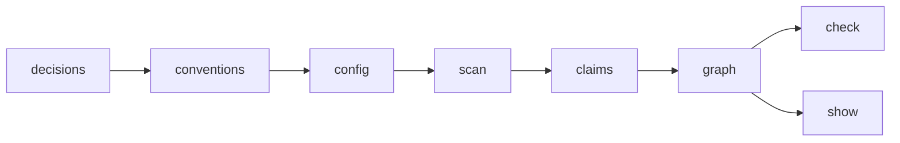

# v0 Dogfood Roadmap Proposal

## Goal

- Dogfood `patram` in this repo.
- Index `docs/**/*.md`.
- Run `patram check`.
- Run `patram show docs/patram.md`.

## Scope

- Markdown only.
- JSON config only.
- CLI only.
- `check` and `show` only.
- No web app work.
- No HTML parsing.
- No JSDoc parsing.
- No add/remove/define commands.
- No inference.
- No aliases.

## Order

1. Finalize decisions.
2. Finalize conventions.
3. Add repo config.
4. Load config.
5. Scan files.
6. Parse claims.
7. Materialize graph.
8. Implement `check`.
9. Implement `show`.
10. Dogfood in this repo.

## Proposed Changes

- Add `.patram.json`.
- Add `lib/load-patram-config.js`.
- Add `lib/list-source-files.js`.
- Keep `lib/parse-claims.js`.
- Add `lib/build-graph.js`.
- Add `lib/check-graph.js`.
- Add `lib/render-show.js`.
- Wire commands in `bin/patram.js`.

## Milestones

### M1

- Config loads.
- Files scan.
- Claims parse.
- Tests pass.

### M2

- Graph materializes.
- `patram check` reports diagnostics.
- Tests pass.

### M3

- `patram show <file>` prints source and resolved summary.
- Dogfood on repo docs.
- Tests pass.

## Acceptance

- `patram check` exits `0` on valid repo state.
- `patram check` exits `1` on diagnostics.
- `patram show docs/patram.md` works from repo root.
- `npm run all` passes.
