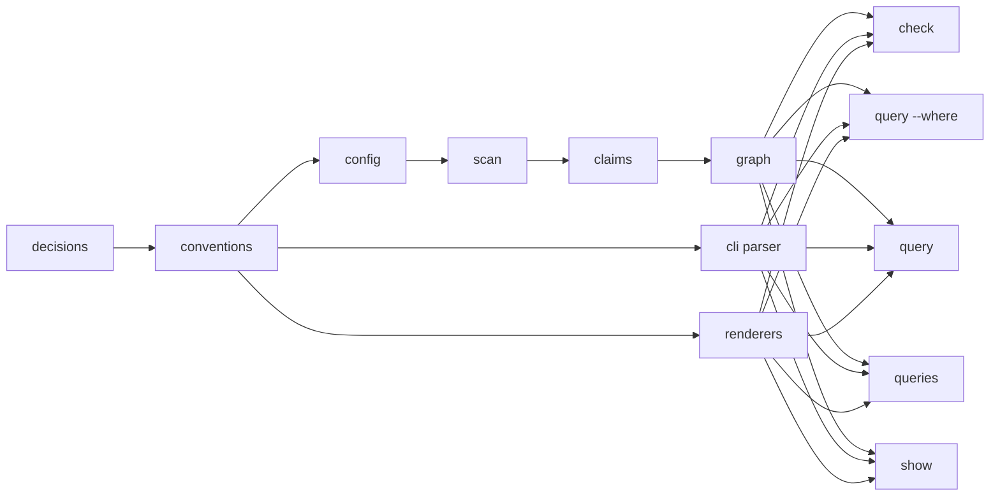

# v0 Dogfood Roadmap Proposal

- Kind: roadmap
- Status: active

## Goal

- Dogfood `patram` in this repo.
- Index `docs/**/*.md`.
- Run `patram check`.
- Run `patram query --where "kind=task and status=pending"`.
- Run `patram query pending-tasks`.
- Run `patram show docs/patram.md`.
- Run `patram show docs/patram.md --json`.

## Scope

- Markdown only.
- JSON config only.
- CLI only.
- `check`, `query`, `queries`, and `show` only.
- Shared `plain`, `rich`, and `json` output modes.
- Node filtering only.
- Relation existence checks only.
- Stored queries in config.
- No web app work.
- No HTML parsing.
- No JSDoc parsing.
- No add/remove/define commands.
- No inference.
- No aliases.
- No traversal language.

## Order

1. Finalize decisions.
2. Finalize conventions.
3. Add repo config.
4. Load config.
5. Scan files.
6. Parse claims.
7. Materialize graph.
8. Implement `check`.
9. Implement `query --where`.
10. Implement `query <name>`.
11. Implement `queries`.
12. Implement the CLI argument parser.
13. Implement the CLI output renderers.
14. Implement `show`.
15. Dogfood in this repo.

## Proposed Changes

- Add `.patram.json`.
- Add `lib/load-patram-config.js`.
- Add `lib/list-source-files.js`.
- Keep `lib/parse-claims.js`.
- Add `lib/build-graph.js`.
- Add `lib/check-graph.js`.
- Add `lib/query-graph.js`.
- Add `lib/list-queries.js`.
- Add `lib/parse-cli-arguments.js`.
- Add `lib/resolve-output-mode.js`.
- Add `lib/render-output-view.js`.
- Add `lib/render-plain-output.js`.
- Add `lib/render-rich-output.js`.
- Add `lib/render-json-output.js`.
- Add `lib/render-show.js`.
- Update runtime formatting dependencies in `package.json`.
- Wire commands in `bin/patram.js`.

## Milestones

### M1

- [Add repo config](../tasks/v0/add-repo-config.md)
- [Load config](../tasks/v0/load-config.md)
- [Scan source files](../tasks/v0/scan-source-files.md)
- [Parse claims](../tasks/v0/parse-claims.md)
- Tests pass.

### M2

- [Materialize graph](../tasks/v0/materialize-graph.md)
- [Implement check command](../tasks/v0/check-command.md)
- Tests pass.

### M3

- [Implement query command](../tasks/v0/query-command.md)
- [Implement stored queries](../tasks/v0/stored-queries.md)
- Tests pass.

### M4

- [Implement CLI argument parser](../tasks/v0/cli-argument-parser.md)
- [Implement CLI output renderers](../tasks/v0/cli-output-renderers.md)
- [Implement show command](../tasks/v0/show-command.md)
- Dogfood on repo docs.
- Tests pass.

## Acceptance

- `patram check` exits `0` on valid repo state.
- `patram check` exits `1` on diagnostics.
- `patram query --where "kind=task and status=pending"` works.
- `patram query pending-tasks` works.
- `patram queries` works.
- `patram show docs/patram.md` works from repo root.
- `patram show docs/patram.md --json` works from repo root.
- `npm run all` passes.
