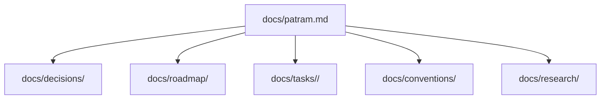

# Docs Structure Proposal

- Kind: convention
- Status: active

- `docs/patram.md`: Product definition.
- `docs/decisions/`: Decision records.
- `docs/roadmap/`: Implementation plans.
- `docs/tasks/<version>/`: Work items grouped by version.
- `docs/conventions/`: Naming, config, graph, CLI, output conventions.
- `docs/research/`: Exploratory notes.

- One decision per file.
- One roadmap per milestone.
- One conventions file per topic or version.
- Prefer append-only decisions.
- Prefer short files.
- Prefer examples over prose.

